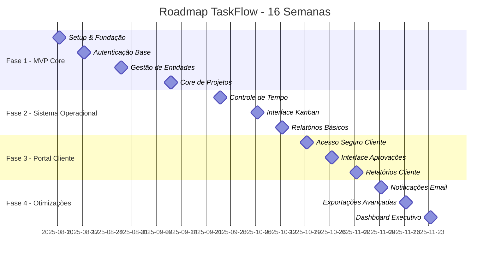

# Roadmap de Desenvolvimento - TaskFlow

## Visão Geral

Este roadmap define a estratégia de desenvolvimento do TaskFlow em 4 fases principais, estruturadas ao longo de 16 semanas. Cada fase entrega valor incremental, permitindo validação e ajustes contínuos do produto.

**Meta Principal:** Criar uma plataforma completa de gestão de projetos com controle de tempo, aprovações de cliente e relatórios avançados.

---

## Épicos Identificados

### 🏗️ Épico 1: Fundação da Aplicação
- Setup do ambiente Laravel Sail + Docker
- Configuração inicial do banco de dados MySQL + Redis
- Setup básico de autenticação
- Interface base com Tailwind CSS + ShadCN UI
- Configuração de testes automatizados

### 🔐 Épico 2: Sistema de Autenticação Completo
- Login tradicional e registro de usuários
- Integração com Google OAuth 2.0
- Sistema de papéis (admin, colaborador, cliente)
- Middleware de autorização e proteção
- Recuperação de senha

### 👥 Épico 3: Gestão de Entidades Base
- CRUD de empresas e equipes
- CRUD de clientes e relacionamentos
- CRUD de usuários e perfis
- Sistema de convites e permissões
- Relacionamentos entre entidades

### 📋 Épico 4: Core do Sistema de Projetos
- CRUD de projetos com metadados
- Sistema de pipelines Kanban personalizáveis
- CRUD de tarefas com estimativas e prioridades
- Modelos reutilizáveis de tarefas por tipo de serviço
- Upload de arquivos e comentários

### ⏱️ Épico 5: Controle de Tempo
- Timer play/pause por tarefa
- Controle de tarefa única ativa por usuário
- Histórico detalhado de tempo trabalhado
- Visualizações temporais (hoje, semana, mês)
- Relatórios de produtividade

### 👤 Épico 6: Portal do Cliente
- Acesso seguro via token ou convite
- Interface Kanban simplificada para clientes
- Sistema de aprovações com comentários
- Visualização de progresso do projeto
- Notificações de status

### 📊 Épico 7: Relatórios e Dashboards
- Relatórios de horas contratadas vs utilizadas
- Exportação em múltiplos formatos (CSV/XLS/PDF)
- Dashboard executivo com KPIs
- Filtros avançados por projeto/cliente/período
- Gráficos de produtividade

### 🔔 Épico 8: Notificações e Comunicação
- Sistema de notificações por email
- Logs detalhados de atividades
- Notificações em tempo real (opcional)
- Templates personalizáveis de email
- Configurações de preferências

---

## Fases de Desenvolvimento

## 🚀 FASE 1: MVP Core (4-6 semanas)
**Objetivo:** Sistema funcional básico para uso interno da equipe

### Milestones

#### M1.1 - Setup e Fundação (Semana 1)
**Entregáveis:**
- Ambiente Laravel Sail configurado
- Docker Compose com MySQL + Redis
- Estrutura base do projeto
- CI/CD básico configurado
- Documentação de setup

**Critérios de Aceitação:**
- [ ] Aplicação roda em containers Docker
- [ ] Banco de dados conecta corretamente
- [ ] Testes automatizados executam
- [ ] Documentação permite setup por nova pessoa

#### M1.2 - Autenticação Base (Semana 2)
**Entregáveis:**
- Login/logout tradicional
- Registro de usuários
- Sistema básico de papéis
- Middleware de proteção
- Interface de login responsiva

**Critérios de Aceitação:**
- [ ] Usuários podem se registrar e fazer login
- [ ] Senhas são criptografadas adequadamente
- [ ] Sessões funcionam corretamente
- [ ] Rotas protegidas funcionam

#### M1.3 - Gestão de Entidades (Semanas 3-4)
**Entregáveis:**
- CRUD completo de empresas
- CRUD completo de clientes
- CRUD completo de usuários
- Sistema de relacionamentos
- Interface administrativa

**Critérios de Aceitação:**
- [ ] Empresas podem ser criadas e gerenciadas
- [ ] Clientes são associados a empresas
- [ ] Usuários têm papéis definidos
- [ ] Relacionamentos funcionam corretamente

#### M1.4 - Core de Projetos (Semanas 5-6)
**Entregáveis:**
- CRUD de projetos
- CRUD de tarefas básicas
- Interface Kanban simples
- Atribuição de tarefas
- Status de progresso

**Critérios de Aceitação:**
- [ ] Projetos podem ser criados e configurados
- [ ] Tarefas movem entre colunas Kanban
- [ ] Usuários podem ser atribuídos a tarefas
- [ ] Status de tarefas são atualizados

---

## ⚡ FASE 2: Sistema Operacional (3-4 semanas)
**Objetivo:** Funcionalidades essenciais para uso produtivo

### Milestones

#### M2.1 - Controle de Tempo (Semanas 7-8)
**Entregáveis:**
- Timer play/pause funcional
- Controle de tarefa única ativa
- Histórico de tempo detalhado
- Validações de integridade
- Interface de controle intuitiva

**Critérios de Aceitação:**
- [ ] Apenas uma tarefa ativa por usuário
- [ ] Tempo é registrado automaticamente
- [ ] Histórico é preservado corretamente
- [ ] Interface é responsiva e clara

#### M2.2 - Interface Kanban Funcional (Semana 9)
**Entregáveis:**
- Drag & drop entre colunas
- Colunas personalizáveis
- Filtros por status/usuário
- Busca de tarefas
- Visualizações otimizadas

**Critérios de Aceitação:**
- [ ] Tarefas movem fluidamente entre colunas
- [ ] Mudanças são salvas automaticamente
- [ ] Filtros funcionam corretamente
- [ ] Performance é adequada

#### M2.3 - Relatórios Básicos (Semana 10)
**Entregáveis:**
- Relatório de horas por projeto
- Relatório de produtividade por usuário
- Exportação em CSV básica
- Filtros por período
- Gráficos simples

**Critérios de Aceitação:**
- [ ] Dados são precisos e consistentes
- [ ] Exportação gera arquivos válidos
- [ ] Filtros funcionam adequadamente
- [ ] Gráficos são legíveis

---

## 👥 FASE 3: Portal do Cliente (2-3 semanas)
**Objetivo:** Clientes podem acompanhar e aprovar trabalhos

### Milestones

#### M3.1 - Acesso Seguro do Cliente (Semana 11)
**Entregáveis:**
- Sistema de tokens de acesso
- Interface específica para clientes
- Controle de permissões
- Login simplificado
- Segurança reforçada

**Critérios de Aceitação:**
- [ ] Clientes acessam apenas seus projetos
- [ ] Tokens têm validade e segurança adequadas
- [ ] Interface é simplificada e intuitiva
- [ ] Não há vazamento de dados

#### M3.2 - Interface de Aprovações (Semana 12)
**Entregáveis:**
- Sistema de aprovação/rejeição
- Comentários integrados
- Notificações de mudanças
- Histórico de aprovações
- Interface otimizada mobile

**Critérios de Aceitação:**
- [ ] Aprovações são registradas corretamente
- [ ] Comentários são preservados
- [ ] Notificações são enviadas
- [ ] Funciona bem em dispositivos móveis

#### M3.3 - Relatórios para Cliente (Semana 13)
**Entregáveis:**
- Relatório de horas utilizadas vs contratadas
- Progresso visual do projeto
- Histórico de entregas
- Exportação customizada
- Dashboard cliente

**Critérios de Aceitação:**
- [ ] Relatórios são precisos e claros
- [ ] Cliente entende facilmente o progresso
- [ ] Exportações são profissionais
- [ ] Dashboard carrega rapidamente

---

## 📈 FASE 4: Otimizações e Automação (2-3 semanas)
**Objetivo:** Sistema robusto com automações e relatórios avançados

### Milestones

#### M4.1 - Notificações por Email (Semana 14)
**Entregáveis:**
- Templates de email profissionais
- Notificações automáticas configuráveis
- Sistema de preferências
- Queue de emails
- Logs de envio

**Critérios de Aceitação:**
- [ ] Emails são enviados consistentemente
- [ ] Templates são profissionais e claros
- [ ] Usuários podem configurar preferências
- [ ] Performance não é impactada

#### M4.2 - Exportações Avançadas (Semana 15)
**Entregáveis:**
- Exportação em PDF com layout profissional
- Exportação XLS com formatação
- Relatórios customizáveis
- Agendamento de relatórios
- Templates personalizáveis

**Critérios de Aceitação:**
- [ ] PDFs têm layout profissional
- [ ] XLS mantém formatação adequada
- [ ] Customizações funcionam corretamente
- [ ] Performance é aceitável

#### M4.3 - Dashboard Executivo (Semana 16)
**Entregáveis:**
- KPIs principais em tempo real
- Gráficos interativos
- Métricas de produtividade
- Comparativos por período
- Insights automáticos

**Critérios de Aceitação:**
- [ ] Dados carregam rapidamente
- [ ] Gráficos são precisos e úteis
- [ ] Interface é intuitiva
- [ ] Insights agregam valor

---

## Dependências e Sequenciamento

### Dependências Críticas

```
📋 Fluxo de Dependências:
Autenticação → Gestão de Entidades → Core de Projetos → Controle de Tempo → Portal Cliente → Relatórios Avançados
```

**🔒 Blockers Principais:**
1. **Autenticação** → Base para todas as funcionalidades
2. **Gestão de Entidades** → Necessária para projetos e tarefas
3. **Core de Projetos** → Fundação para controle de tempo
4. **Controle de Tempo** → Base para relatórios precisos
5. **Sistema de Papéis** → Essencial para portal do cliente

### Riscos Identificados

**⚠️ Riscos Técnicos:**
- **OAuth Google:** Pode ter complexidade adicional na integração
- **Exportação PDF:** Requer bibliotecas específicas e pode impactar performance
- **Sistema de Notificações:** Configuração de SMTP pode ser complexa
- **Controle de Tempo Único:** Lógica de estado complexa para garantir consistência
- **Relatórios Complexos:** Queries pesadas podem impactar performance

**🎯 Mitigações:**
- Prototype OAuth em ambiente separado
- Teste bibliotecas PDF antecipadamente
- Configure email service desde o início
- Implemente testes rigorosos para controle de tempo
- Otimize queries e considere cache para relatórios

---

## Cronograma Detalhado



---

## Próximos Passos Imediatos

### 📋 Ações Esta Semana (M1.1 - Setup e Fundação):

1. **Configurar Ambiente de Desenvolvimento**
   - [ ] Instalar Laravel Sail
   - [ ] Configurar Docker Compose (Laravel + MySQL + Redis)
   - [ ] Setup inicial do Git com .gitignore adequado
   - [ ] Documentar processo de setup

2. **Estrutura Base do Projeto**
   - [ ] Configurar Tailwind CSS + ShadCN UI
   - [ ] Setup de testes (PHPUnit + Feature Tests)
   - [ ] Configurar linting (PHP CS Fixer)
   - [ ] Structure básica de pastas

3. **Configurações Iniciais**
   - [ ] Configurar variáveis de ambiente
   - [ ] Setup de logs estruturados
   - [ ] Configurar cache Redis
   - [ ] Documentar arquitetura inicial

### 🎯 Próxima Semana (M1.2 - Autenticação Base):

1. **Sistema de Autenticação**
   - [ ] Implementar registro de usuários
   - [ ] Login/logout funcional
   - [ ] Middleware de autenticação
   - [ ] Recuperação de senha

2. **Interface Básica**
   - [ ] Layout principal com navegação
   - [ ] Formulários de login/registro
   - [ ] Dashboard inicial (placeholder)
   - [ ] Responsividade mobile

---

## Definição de Pronto (DoD)

Para que cada milestone seja considerado completo:

### ✅ Critérios Técnicos:
- [ ] Código revisado e aprovado
- [ ] Testes automatizados passando (>80% cobertura)
- [ ] Documentação atualizada
- [ ] Performance dentro dos limites aceitáveis
- [ ] Segurança validada

### ✅ Critérios de Produto:
- [ ] Funcionalidades testadas manualmente
- [ ] Interface aprovada (UX/UI)
- [ ] Compatibilidade mobile verificada
- [ ] Dados de teste criados
- [ ] Demo funcional disponível

### ✅ Critérios de Qualidade:
- [ ] Sem bugs críticos conhecidos
- [ ] Logs estruturados implementados
- [ ] Tratamento de erros adequado
- [ ] Validações de entrada funcionais
- [ ] Backup/rollback testado

---

## Recursos e Contatos

**👥 Equipe Recomendada:**
- 1 Desenvolvedor Full-Stack (Laravel + Frontend)
- 1 Product Owner (part-time para validações)
- 1 QA (part-time para testes)

**📚 Recursos Técnicos:**
- [Documentação Laravel Sail](https://laravel.com/docs/sail)
- [ShadCN UI Components](https://ui.shadcn.com/)
- [Tailwind CSS](https://tailwindcss.com/)
- [Laravel Testing](https://laravel.com/docs/testing)

**🔗 Links Importantes:**
- Repositório: `[A definir]`
- Ambiente de Staging: `[A definir]`
- Documentação Técnica: `docs/architecture/`
- PRD Completo: `docs/prd/`

---

*Roadmap criado em: {{ date('Y-m-d') }}*  
*Próxima revisão: {{ date('Y-m-d', strtotime('+2 weeks')) }}*